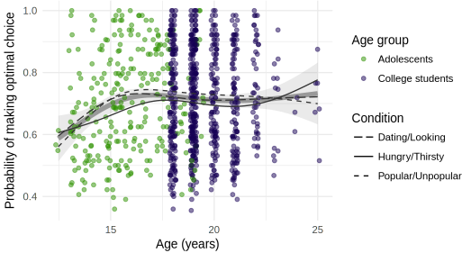
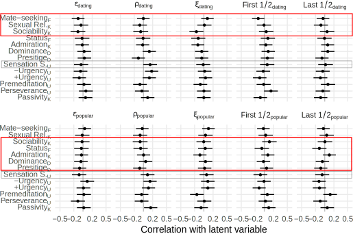
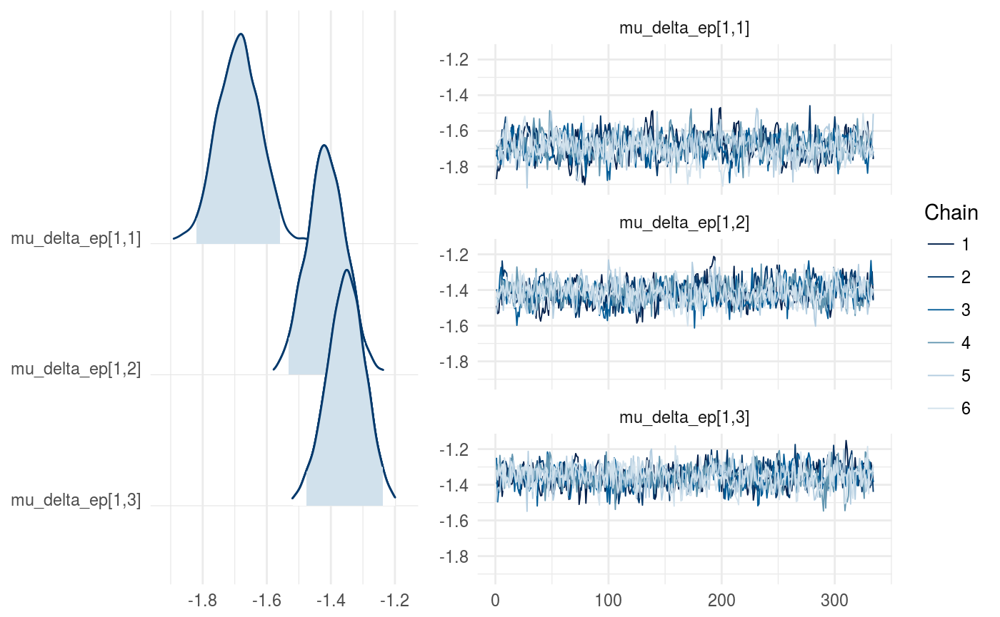
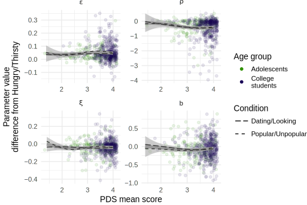
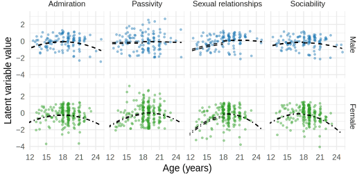
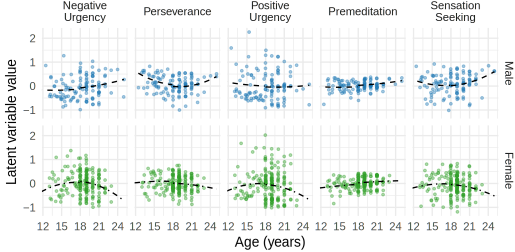
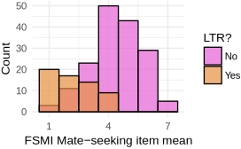
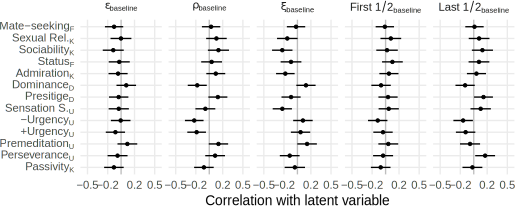

```{r setup, include=FALSE}
knitr::opts_chunk$set(echo = FALSE)
# load('~/code_new/social-motives-rl-writeup/rda/descriptive-statistics.rda')
# load('~/code_new/social-motives-rl-writeup/rda/fit-model-to-participant-data.rda')
# load('~/code_new/social-motives-rl-writeup/rda/age-learning-association.rda')
load('~/code_new/social-motives-rl-writeup/rda/extra-model-plots.rda')
```

## The importance of adolescence

- Transition from quiescent childhood to adulthood
- Avoidable health-risks increase

## Lenses for understading adolescence

- "Imbalanced" brain-system development (Casey et al., 2016; Shulman et al., 2016)
- Need for exploration (Romer et al., 2017)
- Social reorientation toward peers (Nelson et al., 2016)
- Can we get more specific about functional relevance of behavior?

## Status and Mate-seeking

- Sexual activity as a risk-factor
- Popularity: antecedents and consequences
- Status and Mate-seeking as developmentally appropriate goals
- Motives encourage behaviors that satisfice them
- How much of adolescent decision making is in service of these motives?
- To know we need to measure them.

## Measuring social motives in the lab

- What might be influenced by differences in motivations?
- Attentional learning: cue salience influenced by past predictive value (Kruschke, 2011; Mackintosh, 1975)
- Information relevant to social motivations should be learned more quickly

## The Social Probabilistic Learning Task (SPLT)


- Association between each of 6 faces with one of 2 words
- **Hungry/Thirsty**  
  **Dating/Looking**  
  **Popular/Unpopular**
- Each trial  
  press $\leftarrow$ or $\rightarrow$  
  receive feedback
- Probabilisitic: Best answer rewarded 80%
- 8 blocks x 8 trials x 6 faces = 384 trials

## Aims

1. Does this "motivational framing" enhance learning?
2. Does motive-related learning enhancement covary with development as we would expect?
3. Does learning enhancement relate to self-report motives?

## Participants

| Sample                  |   N *Male* |*Female*|   Age *Male* |   *Female* |
|-------------------------|-----------:|-------:|-------------:|-----------:|
| Foster-care adolescents |         19 |     20 |   15.6 (1.5) | 17.0 (1.7) |
| Community adolescents   |         29 |     36 |   15.5 (1.5) | 15.6 (1.7) |
| College Students        |         33 |     52 |   20.9 (4.2) | 19.3 (1.3) |
| College Students Online |         37 |    104 |   19.8 (1.4) | 19.3 (1.2) |

- 313 participants provided task data (334 - 21 missing)
- N=13 missing were from the foster-care adolescent sample

## Participants Pubertal Development


## Approach to modeling task behavior

1. Lo-fi: Average number of optimal decisions during last 1/2 of the run.
  - H1: More optimal decisions in motive-conditions
  - H2: Size of difference will be bigger in more developed participants 
  - H3: Size of difference will +correlate with self-report motives
2. Formal: Rescorla-Wagner iterative learning model
  - Model paramter differences between conditions
  - Explore individual differences

## Low-fi: Does motive-framing enhance learning?


**D/L**  
t(185) = 2.69,  
D = .029  
p = .008 

**P/U**  
t(185) = 4.54,  
D = .047  
p = .00001

## Modeling using iterative instrumental learning

Probability of pressing $\rightarrow$ on each trial is determined by an action weight.

Action weight is a function of: 

1. Right-bias $b$ - Some people might just be prone to (not) pressing $\rightarrow$
2. "Noise" $\xi$ - Random responding (attention, hurrying, lower ability)
3. Reward-value $\rho$ - How rewarding are those points you get?
4. Learning-rate $\epsilon$ - How much are you affected be each trial?

## Learning rate differences


3: Popular/Unpopular; 2: Dating/Looking; 1: Hungry/Thirsty

## Reward sensitivity differences


3: Popular/Unpopular; 2: Dating/Looking; 1: Hungry/Thirsty

## Irriducible noise differences


3: Popular/Unpopular; 2: Dating/Looking; 1: Hungry/Thirsty

## Right-bias differences


3: Popular/Unpopular; 2: Dating/Looking; 1: Hungry/Thirsty

## Aim 1 Summary: Motive effects on learning

<div style="margin: auto;width: 80%;text-align: left; border:1px solid grey;">
1. Overall better learning in motive conditions
2. Possibly due to higher learning rate, lower noise
</div>

## Correlations with development

Does learning enhancement reflect motives that, ostensibly, develop during adolescence?

Indices of development:

- Age
- Pubertal Development Scale (Petersen et al., 1988)

## Optimal choice performance and age



## Optimal choice performance and puberty


## Model parameters and age


## Model parameters and puberty


## Aim 2 Summary: Motive effects and development

<div style="margin: auto;width: 80%;text-align: left; border:1px solid grey;">
1. Condition-differences similar at different ages & PDS scores.
1. More developed participants perform better...
2. ...likely due to less "noise" ($\xi$).
</div>

## Correlations with self-report motives

Does learning enhancement reflect motive differences as measured by self-report?

Measures related to social motives (College samples only)

- Fundamental Social Motives Inventory (FSMI; Neel et al., 2015)
- Dominance & Prestige Strategies (D&P; Cheng et al., 2013)

Measures related to social motives (All samples)

- Kids' Social Reward Questionnaire (K-SRQ; Foulkes et al., 2014)
- Urgency and Sensation-Seeking (UPPS-P; Whiteside et al., 2005)

*nb: all analyses done using latent variable measurement models*

## College samples



## All samples


## Aim 3 Summary: Motive effects and self-report motives

<div style="margin: auto;width: 80%;text-align: left; border:1px solid grey;">
1. No significant correlations with convergent measures.
2. All $|r| < .2$ (many "significantly" so)
</div>

## General conclusions

1. Learning is affected by "motive" framing
2. Individual differences don't behave as expected
    - One possibility: these motives _don't_ develop during adolescence  
    AND  
    Self-report measures _don't_ measure motives
    - Another possibility: the task effect is not the result of motives, per se
      - Descriptors vary along many possible dimensions
    - One more: individual differences in the task are badly measured
3. We did learn something about reinforcement learning

## These results in context

1. Generally, adults, or young adults, perform better than adolescents or children<sup>1</sup> 
    - This study is the largest cross-sectional, and second to @peters2017 longitudinal
2. Some author propose that purported hightened reward sensitivity during adolescence may enhance learning.
    - Scant evidence in the literature [@davidow2016]
    - No evidence of adolescent-specific benefit
    - No evidence of adolescent-reward sensitivity (e.g., $rho$)
3. Very little work on instrumental learning of social information in adolescence.

<span style="font-size:8pt">1 @duijvenvoorde2008; @decker2015; @bos2009; @cohen2010; @christakou2013; @palminteri2016; @rosenblau2017; @peters2017; @mccormick2017.</span>

## Thanks to...

*My committee:* Jenn Pfeifer, Sanjay Srivastava, Elliot Berkman, Nicole Giuliani

All 334 participants

*TDS Study Coordinators:* Maurine Durnin, Garrett Ross

*Research assistants:* Emily Talbot, Marina Parker, Hannah Fraser, Cameron Hansen

The DSN and PSD Labs

## Summary of conclusions

> 1. Learning is affected by "motive" framing
> 2. Individual differences don't behave as expected
> 3. Behavior/development correlations are consistent with previous literature

## Extra slides follow

## Individual-level parameter correlations


## Individual-level parameter and behavior


## Individual-level parameter confidence


## Epsilon chains



## Rho chains


## Xi chains


## b chains


## Model predictions through identical runs


## Model predicted versus observed proportions

```{r out.width="80%"}
ggplot2::theme_set(ggplot2::theme_minimal())
splt_data_used_pR_block_sum_plot
```

## Learning enhancement with Age


$\beta_{\text{adolescent}} = .08;\beta_{\text{college}} = .01$

## Learning enhancement with Puberty


$\beta_{\text{adolescent}} = .03; \beta_{\text{college}} = .02$

## Model condition differences and Age


## Model condition differences and Puberty



## K-SRQ and age



## K-SRQ and PDS


## UPPS-P and age



## UPPS-P and PDS


## FSMI Mate-seeking



## FSMI Mate-seeking


## Baseline task correlations - College



## Baseline task correlations - All


## Baseline task correlations - All


## Var prop due to posterior means

Variance among posterior means for individual-level parameters versus total variance in posteriors:

.37, and the rest .45 - .56 

For raw behavior, roughly:

H/T: 0.24, $\Delta$D/L: 0.13, $\Delta$P/U: 0.14

##  $\epsilon$ individual differences

```{r out.width="80%"}
ggplot2::theme_set(ggplot2::theme_minimal())
beta_estimates_by_sample_ep_prm_plot
```

##  $\rho$ individual differences

```{r out.width="80%"}
ggplot2::theme_set(ggplot2::theme_minimal())
beta_estimates_by_sample_rho_prm_plot
```

##  $\xi$ individual differences

```{r out.width="80%"}
ggplot2::theme_set(ggplot2::theme_minimal())
beta_estimates_by_sample_xi_prm_plot
```

##  $b$ individual differences

```{r out.width="80%"}
ggplot2::theme_set(ggplot2::theme_minimal())
beta_estimates_by_sample_b_plot
```