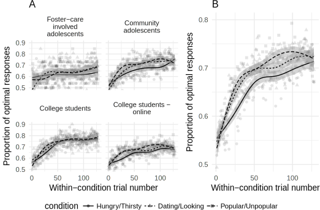
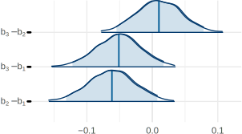
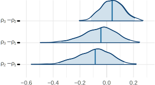
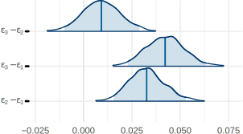
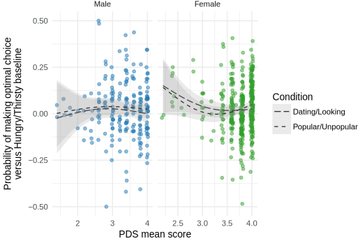
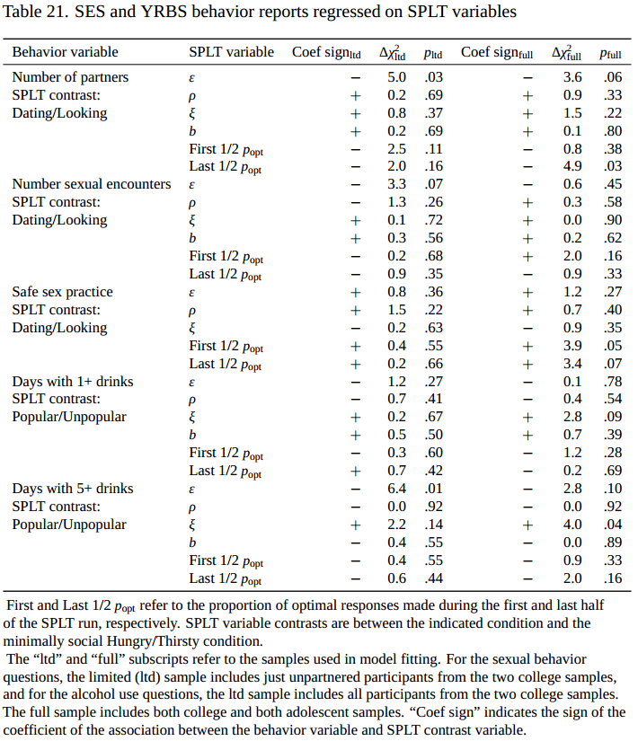

```{r setup, include=FALSE}
knitr::opts_chunk$set(echo = FALSE)
# load('~/code_new/social-motives-rl-writeup/rda/descriptive-statistics.rda')
# load('~/code_new/social-motives-rl-writeup/rda/fit-model-to-participant-data.rda')
# load('~/code_new/social-motives-rl-writeup/rda/age-learning-association.rda')
load('~/code_new/social-motives-rl-writeup/rda/extra-model-plots.rda')
```

## Background: Adolescence is a period of social reorientation

- Romantic and sexual interests develop (W. A. Collins et al., 2009)
- Spend less time with family, more time alone or with peers (Larson & Richards, 1991)
- Give status more priority (LaFontana & Cillessen, 2010)

## Two faces of social reorientation: risk

- Sexual behavior during adolescence itself as health risk 
    - Youth Risk Behavior Survey considers ever having had sex as a risk-factor to be reduced (CDC, 2018)
- Romantic relationships can be a source of emotional distress (W. A. Collins et al, 2009)
- Minor delinquency, substance use may be an antecedent & consequence of popularity (Allen et al., 2005; de Bruyn & Weisfeld, 2017)

## Two faces of social reorientation: Benefit

- Evolutionary psychology perspective 
    - Development of motivations evolved in response to fitness challenges (Ellis et al., 2012; Schaller et al., 2017)
    - Finding mates, and gaining status
- Satisfaction of these motives might support well-being
    - Being in a relationship associated with higher self-worth  (W. A. Collins et al, 2009)
    - Controlling for genetic confounds, sexual activity in romantic relationships is related to less delinquency (Harden & Mendle, 2011)
    - Popularity also prospectively associated with decreases in overt hostility (Allen et al., 2005)
    - Adolescent social status associated with adult income (Shi & Moody, 2017)

## Mechanisms of social reorientation

- Neurodevelopmental changes in perceptual, motivational, and executive control brain regions change the way you experience the environment (Nelson et al., 2016)
- May highlight developmentally-relevant opportunities in the environment
    - Directly altering stimulus salience
    - Shifting associations via changes in what someone finds rewarding

## Goal: Measuring social motives in the lab

- Create behavioral task using the effect of salience on learning
- Attentional theories of learning posit that 
    - Salience of a stimulus affects learning
    - Past predictive value of a stimulus can alter its salience (Kruschke, 2011; Mackintosh, 1975)
- Information relevant to social motivations should be more salient and so should be learned more quickly
- As an individual develops through adolescence, this should become more pronounced.

## The Social Probabilistic Learning Task (SPLT)


- People learn an association between each of 6 faces and one of 2 words
- **Hungry/Thirsty**  
  **Dating/Looking**  
  **Popular/Unpopular**
- Each trial
    - presented with a face with 2 potential descriptors
    - press $\leftarrow$ or $\rightarrow$ keys to select which descriptor matches that face
    - receive feedback of 0, 1, 5 points
    - The first time is a wild guess, but people learn over time
    - 20% of the time, people get misleading feedback
- 8 blocks x 8 trials x 6 faces = 384 trials

## Aims

1. Does this "motivational framing" enhance learning?
    - Will people learn the social descriptors better?
2. Does motive-related learning enhancement covary with development as we would expect?
    - Will this effect be stronger in older participants?
3. Does learning enhancement relate to self-report motives?
    - Will this effect be stronger for those that report stronger social motives?

## 334 Participants

Adolescents drawn from ongoing longitudinal study (TDS)  
College students from UO Human Subjects Pool

| Sample                  |    N|     *Male* |*Female*|   Age *Male* |   *Female* |
|-------------------------|----:|-----------:|-------:|-------------:|-----------:|
| Community adolescents   |   65|         29 |     36 |   15.5 (1.5) | 15.6 (1.7) |
| Foster-care adolescents |   39|         19 |     20 |   15.6 (1.5) | 17.0 (1.7) |
| College Students        |   85|         33 |     52 |   20.9 (4.2) | 19.3 (1.3) |
| College Students Online |  141|         37 |    104 |   19.8 (1.4) | 19.3 (1.2) |

- $N=13$ foster-care adolescents don't have task data
- 313 participants provided task data (334 - 21 missing)

## Participants Pubertal Development


## Approaches to describing task behavior

1. Use raw behavior directly: Average number of optimal decisions during last 1/2 of the run.
    - H1: More optimal decisions in motive-conditions
    - H2: Size of difference will be bigger in more developed participants 
    - H3: Size of difference will +correlate with self-report motives
2. Bayesian modeling: Rescorla-Wagner instrumental learning model
    - Examine model parameter differences between conditions
    - Explore individual differences

## Aim 1: Does motive-framing enhance learning?

Raw behavior



**D/L**  
t(185) = 2.69,  
D = .029  
p = .008 

**P/U**  
t(185) = 4.54,  
D = .047  
p = .00001

## How the reinforcement learning model works

- Describes the probability of pressing $\rightarrow$ on each trial
- This probability is determined by an action weight
- Action weight is a function of 4 parameters: 
    1. Right-bias $b$ - Some people might just be prone to (not) pressing $\rightarrow$
    2. "Noise" $\xi$ - Random responding (attention, hurrying, lower ability)
    3. Reward-value $\rho$ - Determines how rewarding the points are
    4. Learning-rate $\epsilon$ - Determines the how influential any given trial is 
- Separate parameter for each condition
- Bayesian analysis to estimate the model and interpret parameter posterior probability densities

## Right-bias differences



3: Popular/Unpopular; 2: Dating/Looking; 1: Hungry/Thirsty

## Noise differences


3: Popular/Unpopular; 2: Dating/Looking; 1: Hungry/Thirsty

## Reward sensitivity differences



3: Popular/Unpopular; 2: Dating/Looking; 1: Hungry/Thirsty

## Learning rate differences



3: Popular/Unpopular; 2: Dating/Looking; 1: Hungry/Thirsty

## Aim 1 Summary: Motive effects on learning

<div style="margin: auto;width: 80%;text-align: left; border:1px solid grey;">
1. Overall better learning in motive conditions
2. Possibly due to higher learning rate, lower noise
</div>

## Aim 2: Correlations with development

Does motive-related learning enhancement covary with development as we would expect?

Indices of development:

- Age
- Pubertal Development Scale (Petersen et al., 1988)

## Optimal choice performance and age

Differences between conditions are relatively constant across age


## Optimal choice performance and puberty


## Model parameters and age


## Model parameters and puberty


## Aim 2 Summary: Motive effects and development

<div style="margin: auto;width: 80%;text-align: left; border:1px solid grey;">
1. More developed participants perform better in general...
2. ...likely due to less random responding ($\xi$).
3. Motive related learning enhancement does not appear to covary with development as we would expect.
    - Older participants do not appear to learn better in social motive conditions.
</div>

## Aim 3: Correlations with self-report motives

Does learning enhancement relate to self-report motives?

Measures related to social motives (College samples only)

- Fundamental Social Motives Inventory (FSMI; Neel et al., 2015)
- Dominance & Prestige Strategies (D&P; Cheng et al., 2013)

Measures related to social motives (All samples)

- Kids' Social Reward Questionnaire (K-SRQ; Foulkes et al., 2014)
- Urgency and Sensation-Seeking (UPPS-P; Whiteside et al., 2005)

*nb: all analyses done using latent variable measurement models*

## College samples


## All samples


## Aim 3 Summary: Motive effects and self-report motives

<div style="margin: auto;width: 80%;text-align: left; border:1px solid grey;">
1. No significant correlations with convergent measures
2. Absolute magnitude of all correlations < .2 (many significantly)
3. Learning enhancement does not relate to self-report motives
</div>

## General conclusions

1. Overall better learning and higher learning rate in social motive conditions.
2. This social motive learning enhancement does not appear to covary with development.
3. Social motive learning enhancement does not relate to self-report of motives.

## Possible explantions

1. Mate-seeking and status motives _don't_ develop during adolescence  
3. Self-report measures _don't_ measure motives
2. Social motives don't affect stimulus salience and so don't affect learning
4. Task behavior is an imprecise measure of individual differences in social motives
    - Task learning is irrelevant to actual social goals (e.g., popularity of computer-generated face is not instrumentally valuable for satisfying a status motive).
    - Binary choice outcomes are less reliable indicators of latent constructs
    - The choice of these particular descriptors may be problematic in some way

## Basic reinforcement learning finding

Adults, or young adults, perform better than adolescents or children

1. This is consistent with most of the literature<sup>1</sup>, and is the largest cross-sectional sample to date
2. Some authors propose that adolescents should perform better than adults due to their heightened reward sensitivity
    - Scant evidence in the literature (Davidow et al., 2016)
    - My data shows no evidence of adolescent-specific benefit
    - No evidence of adolescent-specific-reward sensitivity (e.g., $\rho$)

<span style="font-size:12pt">1 Bos et al., 2009; Christakou et al., 2013; Cohen et al., 2010; Decker et al., 2015; Duijvenvoorde et al., 2008; McCormick & Telzer, 2017; Palminteri et al., 2016; Peters & Crone, 2017; Rosenblau et al., 2017</span>

## Future directions

- Further exploration of the task
    - e.g., expand the range of tested social stimuli
- Explore different types of tasks to measure social motivations
    - e.g., tasks in which the stimuli may be perceived as useful in the pursuit of social goals

## Thanks to...

*My committee:*  
Chair: Jennifer Pfeifer  
Co-Chair: Sanjay Srivastava  
Member: Elliot Berkman  
Outside Member: Nicole Giuliani

Kate Mills, Lisa May

All 334 participants

*TDS Study Coordinators:* Maureen Durnin, Garrett Ross

*Research assistants:* Emily Talbot, Marina Parker, Hannah Fraser, Cameron Hansen

The DSN and PSD Labs

Melanie Berry

## General conclusions

>1. Overall better learning and higher learning rate in social motive conditions.
>2. This social motive learning enhancement does not appear to covary with development.
>3. Social motive learning enhancement does not relate to self-report of motives.

## More slides? You shouldn't have!

## Individual-level parameter correlations


## Individual-level parameter and behavior


## Individual-level parameter confidence


## Epsilon chains


## Rho chains


## Xi chains


## b chains


## Model predictions through identical runs


## Model predicted versus observed proportions

```{r out.width="80%"}
ggplot2::theme_set(ggplot2::theme_minimal())
splt_data_used_pR_block_sum_plot
```

## Learning enhancement with Age


$\beta_{\text{adolescent}} = .08;\beta_{\text{college}} = .01$

## Learning enhancement with Puberty



$\beta_{\text{adolescent}} = .03; \beta_{\text{college}} = .02$

## Model condition differences and Age


## Model condition differences and Puberty


## K-SRQ and age


## K-SRQ and PDS


## UPPS-P and age


## UPPS-P and PDS


## FSMI Mate-seeking


## FSMI Mate-seeking


## Baseline task correlations - College


## Baseline task correlations - All


## Baseline task correlations - All



## Var prop due to posterior means

Variance among posterior means for individual-level parameters versus total variance in posteriors:

.37, and the rest .45 - .56 

For raw behavior, roughly:

H/T: 0.24, $\Delta$D/L: 0.13, $\Delta$P/U: 0.14

##  $\epsilon$ individual differences

```{r out.width="80%"}
ggplot2::theme_set(ggplot2::theme_minimal())
beta_estimates_by_sample_ep_prm_plot
```

##  $\rho$ individual differences

```{r out.width="80%"}
ggplot2::theme_set(ggplot2::theme_minimal())
beta_estimates_by_sample_rho_prm_plot
```

##  $\xi$ individual differences

```{r out.width="80%"}
ggplot2::theme_set(ggplot2::theme_minimal())
beta_estimates_by_sample_xi_prm_plot
```

##  $b$ individual differences

```{r out.width="80%"}
ggplot2::theme_set(ggplot2::theme_minimal())
beta_estimates_by_sample_b_plot
```

## Late task behavior by sample


## Late task behavior by sample

